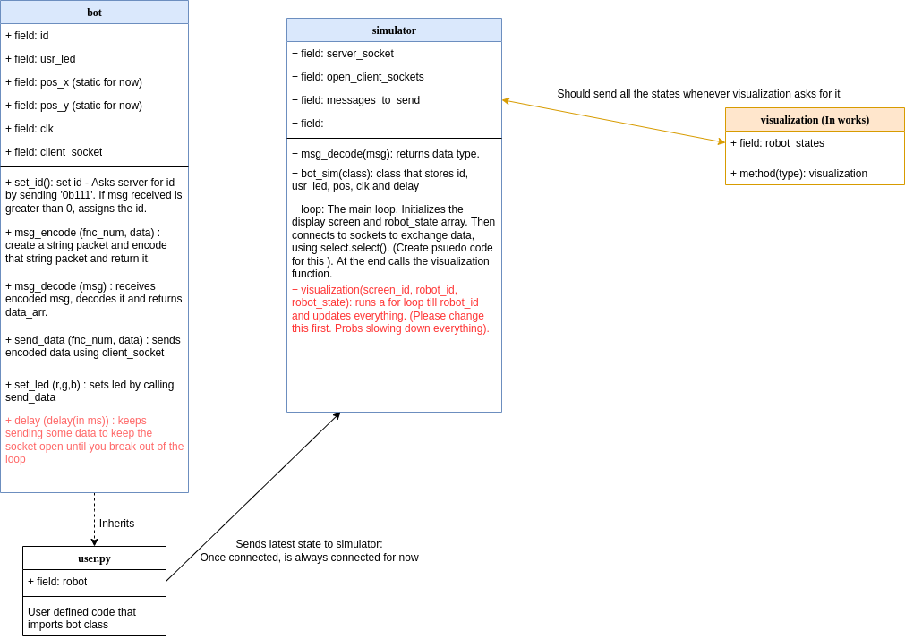
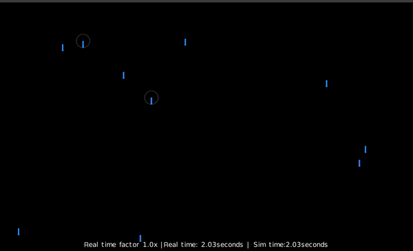

# Swarm Simulation

## How to run 
run `python3 simulator` in one terminal. \
run `./run_parallel.sh 1` in another terminal. 

## Current structure 


## Current Stats

The following user.py code was running 50 times 
```
def usr(robot):

    while True:
        robot.set_led(100,100,0)
        robot.delay(1000)
        robot.set_led(0,100,0)
        robot.delay(1000)

```
<!-- T_real - 0.001 seconds; real time factor - 1 \
 

T_real - 0.001 seconds; real time factor - 2 \


T_real - 0.001 seconds; real time factor - 0.5 \


T_real - 0.0001 seconds; real time factor - 1 \


T_real - 0.0001 seconds; real time factor - 2 \


T_real - 0.0001 seconds; real time factor - 0.5 \
 -->

Firefly \ 



## License
[MIT](https://choosealicense.com/licenses/mit/)