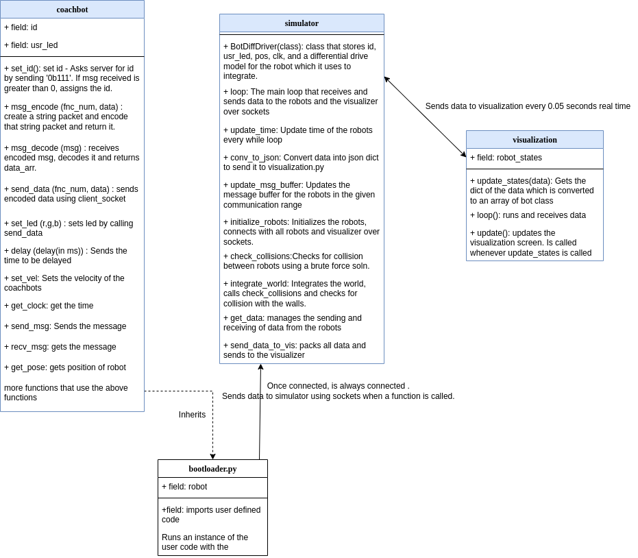

# Swarm Simulation

# Instructions
To run the simulator:
1. Navigate to the `sim_pkg` directory. 
2. Set parameters for the user file in `config.json` if needed.
    * The parameters for each user file are listed at the end of this section.  
3. Run `python3 coachbot_simulator.py -u <userfile> -c <configfile> -i <initfile> -n <num_runs>` 
    * `<userfile>` is the user's program file (e.g. `firefly.py`)
    * `<configfile>` is the file that stores simulation parameters (e.g. `config.json`)
    * `<initfile>` is the file that initializes robot positions (e.g. `init_pose.py`) 
        <!-- * This argument is optional -->
    * `<num_runs>` is the number of simulations to run
        * This argument is optional

<!-- To generate a histogram of recorded collision counts, run `python3 analyze.py` -->

To set the correct packages on a Linux system before running the simultor, run `setup_linux.sh`
* This script does the following:
    * Updates Linux VM
    * Installs miniconda (skip default miniconda installation)
    * Sets up a conda environment “swarm_sim_env” that contains the following modules:
        * Python2: numpy, typing
        * Python3: pygame, pandas

The available user files are listed below. The parameters to set in `config.json` are:
- `firefly.py`
    - USE_INIT_POS: 0
    - NUMBER_OF_ROBOTS: 20
    - COMM_RANGE: 20
    - This file should be run without an `<initfile>` argument
- `lab1.py`
    - USE_INIT_POS: 1
    - NUMBER_OF_ROBOTS: 2
    - COMM_RANGE: 0.7
- `lab2.py`
    - USE_INIT_POS: 1
    - NUMBER_OF_ROBOTS: 256
    - COMM_RANGE: 0.13
- `lab3.py`
    - USE_INIT_POS: 1
    - NUMBER_OF_ROBOTS: 100
    - COMM_RANGE: 0.4
- `lab4.py`
    - USE_INIT_POS: 1
    - NUMBER_OF_ROBOTS: 20
    - COMM_RANGE: 20
- `lab4_m.py`
    - USE_INIT_POS: 1
    - NUMBER_OF_ROBOTS: 20
    - COMM_RANGE: 20

The parameters to set in the config.json file are: 
1. TIME_ASYNC - 0 to make the robot time synced and 1 to introduce time asynchronous initialization for robots 
2. NUMBER_OF_ROBOTS - Number of robots to launch
3. COMM_RANGE - The range of communication (in meters)
4. PACKET_SUCCESS_PERC - See the success rate of message packets (values in decimal range from 0 to 1)
5. REAL_TIME_FACTOR - Maximum allowable real time factor
6. NUM_OF_MSGS - Maximum number of messages to keep in the buffer
7. MSG_SIZE - Maximum size of each message in buffer
8. WIDTH - Width of the arena
9. LENGTH - Length of the arena
10. USE_INIT_POS - Use the initialization python program to initialize position of the robot
11. SIM_TIME_STEP - Set the simulation time step for each loop cycle
12. SIM_TIME - Set the total (wall clock) time for the simulation to run
13. USE_VIS - If 1, then visualizer will be used. 

## Current structure

## Current Program examples

Firefly algorithm

Flocking algorithm with collision 

## License
[MIT](https://choosealicense.com/licenses/mit/)
