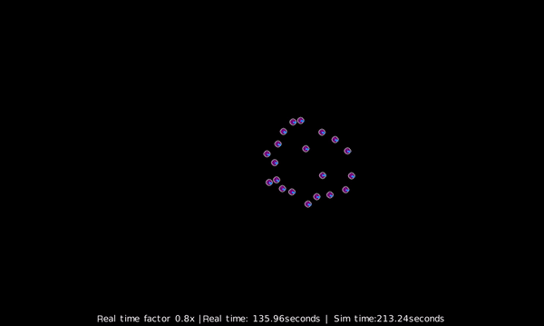

# **Swarm Simulator**
## About
This package provides a simulation environment for swarm robotics. 

## Usage
To set up required packages, run `pip install -r requirements.in`

Each simulation may take three input files: the user file, the configuration file, and the initialization file
* The user file is the robot program file 
* The configuration file stores parameters for the simulation
* The initialization file initializes robot positions in the swarm
    * This file is optional
    * Accepted file formats: ``.py`` or ``.csv`` (where columns correspond to `a_ids`, `x`, `y`, and `theta` in order)

To run the simulator:
1. Move all user, configuration, and intialization files into the `user` directory
2. Navigate to the `sim_pkg` directory
3. Run `python coachbot_simulator.py -b <batchfile>` (or `python coachbot_simulator.py -u <userfile> -c <configfile> -i <initfile>` if you would like to run a standalone simulation)
    * `<batchfile>` is the batch file, which specifies the number of simulations to run ("NUM_RUNS") and the input files to use for each simulation
    * Default input files can be set in the batch file, under "DEFAULT_USER", "DEFAULT_CONFIG", and "DEFAULT_INIT" respectively
        * To exclude the initialization file by default, simply omit "DEFAULT_INIT"
    * The default number of trials for each simulation can be set under "DEFAULT_TRIALS"
    * Files and trial numbers for specific runs can also be set in the batch file
        * e.g. "USER_i" specifies the userfile for the i-th simulation

To generate a histogram of recorded collision counts, run `python analyze.py -f <filename>`
* `<filename>` is the name for the log file containing data about collisions

An example user program `firefly.py`, associated configuration and initialization files `config.json` and `init_pose.py`, and batch file `firefly_batch.json` are provided in the user directory of this repository -- this example can be viewed by running `python coachbot_simulator.py -b firefly_batch.json`

## Configuration parameters
The parameters that can be set in a configuration file are: 
1. NUMBER_OF_ROBOTS (int): number of robots to simulate
2. COMM_RANGE (float): radius of communication for each robot (meters)
3. PACKET_SUCCESS_PERC (float): success rate of sending messages (between 0 and 1)
4. NUM_OF_MSGS (int): maximum number of messages each robot can keep in its message buffer
5. MSG_SIZE (int): maximum size of each message (bytes)
6. MSG_TYPE (int): set the type of messages to string (0) or bytes (1)
7. TIME_ASYNC (int): set time synchronous (0) or asynchronous (1) initialization for robots
8. REAL_TIME_FACTOR (float): maximum allowed real time factor (ratio of simulated time to actual time)
9. SIM_TIME_STEP (float): set the (simulation) time step (how much time each iteration of the simulation loop should model)
10. SIM_TIME (float): set the maximum allowed (simulation) time for the simulation to run
11. WIDTH (float): width (height) of arena (meters)
12. LENGTH (float): length of the arena (meters)
13. USE_VIS (int): set whether (1) or not (0) to use the simulator GUI
14. (optional) EXTRA (list): set parameters for robot creation and destruction

    This simulator allows for robots to be added to the environment one at a time, at a specified time interval. Robots can also be destroyed once they reach a specified circular area. 
    
    The parameters contained in this field are (in order): initial number of robots (int), x coordinate for robot creation (float), y coordinate for robot creation (float), time interval for robot creation (float), x coordinate for robot destruction (float), y coordinate for robot destruction (float), radius for area of robot destruction (float), indicator for whether or not to reuse past robot ids for new robot creation (int, 1 or 0).

## Code structure

## Program examples

Firefly algorithm

Flocking algorithm with collision 

## License
[MIT](https://choosealicense.com/licenses/mit/)
